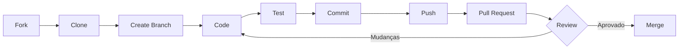

# 🤝 Guia de Contribuição

Obrigado por considerar contribuir com o NutriFitCoach NFC/NFV Platform! Este documento fornece diretrizes para contribuir com o projeto.

---

## 📋 Índice

- [Código de Conduta](#código-de-conduta)
- [Como Contribuir](#como-contribuir)
- [Processo de Development](#processo-de-development)
- [Style Guide](#style-guide)
- [Commits](#commits)
- [Pull Requests](#pull-requests)
- [Reportar Bugs](#reportar-bugs)
- [Sugerir Features](#sugerir-features)

---

## 📜 Código de Conduta

### Nossa Promessa

Nós, como membros, contribuidores e líderes, nos comprometemos a fazer da participação em nossa comunidade uma experiência livre de assédio para todos, independentemente de idade, tamanho corporal, deficiência visível ou invisível, etnia, características sexuais, identidade e expressão de gênero, nível de experiência, educação, status socioeconômico, nacionalidade, aparência pessoal, raça, religião ou identidade e orientação sexual.

### Padrões Esperados

✅ **Comportamentos Esperados:**
- Usar linguagem acolhedora e inclusiva
- Ser respeitoso com pontos de vista e experiências diferentes
- Aceitar críticas construtivas de forma graciosa
- Focar no que é melhor para a comunidade
- Mostrar empatia com outros membros da comunidade

❌ **Comportamentos Inaceitáveis:**
- Uso de linguagem ou imagens sexualizadas
- Trolling, comentários insultuosos/depreciativos e ataques pessoais
- Assédio público ou privado
- Publicar informações privadas de outros sem permissão explícita
- Outra conduta que poderia razoavelmente ser considerada inapropriada em um ambiente profissional

---

## 🚀 Como Contribuir

### 1. Fork o Repositório

```bash
# Via GitHub UI
Click em "Fork" no canto superior direito

# Clone seu fork
git clone https://github.com/SEU_USERNAME/nfc-comunidades.git
cd nfc-comunidades

# Adicione o repositório original como upstream
git remote add upstream https://github.com/nutrifitcoach/nfc-comunidades.git
```

### 2. Configure o Ambiente

```bash
# Instale dependências
npm install

# Configure variáveis de ambiente
cp .env.example .env
# Edite .env com suas configurações

# Execute migrações
npx prisma migrate dev

# Inicie o servidor de desenvolvimento
npm run dev
```

### 3. Crie uma Branch

```bash
# Sincronize com upstream
git fetch upstream
git checkout main
git merge upstream/main

# Crie uma branch para sua feature/fix
git checkout -b feature/nome-da-feature
# OU
git checkout -b fix/nome-do-bug
```

### 4. Faça suas Mudanças

- Escreva código limpo e bem documentado
- Adicione testes para novas funcionalidades
- Atualize documentação se necessário
- Siga o style guide do projeto

### 5. Teste suas Mudanças

```bash
# Execute testes
npm test

# Execute linter
npm run lint

# Execute formatação
npm run format

# Verifique tipos TypeScript
npm run type-check
```

### 6. Commit suas Mudanças

```bash
# Stage suas mudanças
git add .

# Commit com mensagem descritiva
git commit -m "feat: adiciona análise de exercício XYZ"
```

### 7. Push para seu Fork

```bash
git push origin feature/nome-da-feature
```

### 8. Abra um Pull Request

1. Vá para seu fork no GitHub
2. Clique em "Pull Request"
3. Selecione sua branch
4. Preencha o template de PR
5. Aguarde review

---

## 💻 Processo de Development

### Setup Local

#### Opção 1: Docker (Recomendado)

```bash
cd docker
cp .env.example .env
./scripts/validate.sh
make start
```

#### Opção 2: Local (Sem Docker)

```bash
# Instale PostgreSQL 16
# Instale Redis 7
# Configure .env com suas credenciais locais

npm install
npx prisma migrate dev
npm run dev
```

### Estrutura de Diretórios

```
nfc-comunidades/
├── app/                      # Next.js App Router
│   ├── api/                  # API Routes
│   ├── biomechanics/         # Páginas de análise biomecânica
│   └── ...
├── components/               # Componentes React
├── lib/                      # Utilitários e bibliotecas
│   ├── biomechanics/         # Lógica de análise biomecânica
│   ├── prisma.ts             # Prisma client
│   └── ...
├── prisma/                   # Schema e migrações Prisma
├── public/                   # Assets estáticos
├── scripts/                  # Scripts utilitários
├── docker/                   # Infraestrutura Docker
└── tests/                    # Testes
```

### Branches

- **`main`** - Branch principal (protegida, apenas via PR)
- **`develop`** - Branch de desenvolvimento
- **`feature/*`** - Novas features
- **`fix/*`** - Bug fixes
- **`hotfix/*`** - Correções urgentes para produção
- **`release/*`** - Preparação de releases

### Workflow



---

## 📝 Style Guide

### TypeScript/JavaScript

#### Naming Conventions

```typescript
// Variáveis e funções: camelCase
const userName = "John";
function getUserData() {}

// Classes e Tipos: PascalCase
class UserService {}
type UserData = {};
interface IUser {}

// Constantes: SCREAMING_SNAKE_CASE
const MAX_RETRIES = 3;
const API_BASE_URL = "https://api.example.com";

// Arquivos: kebab-case
user-service.ts
video-analysis.tsx
```

#### Código Limpo

```typescript
// ✅ BOM
function calculateROM(startAngle: number, peakAngle: number): number {
  return Math.abs(startAngle - peakAngle);
}

// ❌ RUIM
function calc(a: number, b: number): number {
  return Math.abs(a - b);
}

// ✅ BOM: Comentários descritivos
// Calcula o Range of Motion (ROM) como a diferença absoluta
// entre o ângulo inicial e o ângulo de pico
const rom = calculateROM(startAngle, peakAngle);

// ❌ RUIM: Comentários óbvios
// Calcula ROM
const rom = calculateROM(startAngle, peakAngle);
```

#### Imports

```typescript
// Ordem de imports:
// 1. Externos (React, Next, etc)
// 2. Internos (@/)
// 3. Relativos (./ ../)

import { useState, useEffect } from 'react';
import { useRouter } from 'next/navigation';

import { prisma } from '@/lib/prisma';
import { analyzeVideo } from '@/lib/biomechanics';

import { Button } from './button';
import type { VideoAnalysis } from '../types';
```

### React/Next.js

#### Componentes

```typescript
// ✅ BOM: Functional component com TypeScript
import { FC } from 'react';

interface ButtonProps {
  onClick: () => void;
  children: React.ReactNode;
  variant?: 'primary' | 'secondary';
}

export const Button: FC<ButtonProps> = ({
  onClick,
  children,
  variant = 'primary'
}) => {
  return (
    <button onClick={onClick} className={`btn btn-${variant}`}>
      {children}
    </button>
  );
};

// ❌ RUIM: Sem tipos, sem props
export function Button(props) {
  return <button onClick={props.onClick}>{props.children}</button>;
}
```

#### Hooks

```typescript
// ✅ BOM: Custom hooks com naming e tipagem
import { useState, useEffect } from 'react';

interface UseVideoAnalysisReturn {
  analysis: VideoAnalysis | null;
  loading: boolean;
  error: Error | null;
}

export function useVideoAnalysis(videoId: string): UseVideoAnalysisReturn {
  const [analysis, setAnalysis] = useState<VideoAnalysis | null>(null);
  const [loading, setLoading] = useState(true);
  const [error, setError] = useState<Error | null>(null);

  useEffect(() => {
    // Lógica de fetch
  }, [videoId]);

  return { analysis, loading, error };
}
```

### Prisma

```prisma
// Naming conventions
model User {
  id        String   @id @default(cuid())
  email     String   @unique
  createdAt DateTime @default(now()) @map("created_at")
  updatedAt DateTime @updatedAt @map("updated_at")

  // Relações em camelCase
  videoAnalyses VideoAnalysis[]

  @@map("users")
}
```

### CSS/Tailwind

```typescript
// ✅ BOM: Tailwind com organização
<div className="
  flex flex-col items-center justify-center
  w-full max-w-4xl mx-auto
  px-4 py-8
  bg-white dark:bg-gray-800
  rounded-lg shadow-md
">
  {/* Content */}
</div>

// ❌ RUIM: Desorganizado
<div className="flex w-full bg-white items-center flex-col py-8 px-4 justify-center max-w-4xl mx-auto rounded-lg shadow-md dark:bg-gray-800">
```

---

## 📝 Commits

### Conventional Commits

Usamos [Conventional Commits](https://www.conventionalcommits.org/) para mensagens de commit.

#### Formato

```
<type>(<scope>): <subject>

<body>

<footer>
```

#### Types

- **feat**: Nova feature
- **fix**: Bug fix
- **docs**: Mudanças na documentação
- **style**: Formatação (sem mudança de código)
- **refactor**: Refatoração de código
- **perf**: Melhorias de performance
- **test**: Adição/modificação de testes
- **chore**: Mudanças no build, CI, etc
- **revert**: Reverter commit anterior

#### Exemplos

```bash
# Feature
git commit -m "feat(analysis): adiciona suporte para exercício deadlift"

# Bug fix
git commit -m "fix(upload): corrige validação de tamanho de arquivo"

# Breaking change
git commit -m "feat(api)!: muda formato de resposta da análise biomecânica

BREAKING CHANGE: O formato de resposta agora retorna `motorMetrics` ao invés de `metrics`"

# Múltiplas linhas
git commit -m "refactor(worker): otimiza processamento de frames

- Reduz uso de memória em 40%
- Adiciona cache de frames processados
- Melhora tempo de processamento em 25%

Closes #123"
```

---

## 🔀 Pull Requests

### Template de PR

```markdown
## Descrição
Breve descrição das mudanças.

## Tipo de Mudança
- [ ] Bug fix (mudança que corrige um issue)
- [ ] Nova feature (mudança que adiciona funcionalidade)
- [ ] Breaking change (fix ou feature que causa mudanças incompatíveis)
- [ ] Documentação
- [ ] Refatoração
- [ ] Performance

## Como Testar
1. Passo 1
2. Passo 2
3. Passo 3

## Checklist
- [ ] Meu código segue o style guide do projeto
- [ ] Revisei meu próprio código
- [ ] Comentei código complexo
- [ ] Atualizei a documentação
- [ ] Minhas mudanças não geram novos warnings
- [ ] Adicionei testes que provam que meu fix é efetivo ou que minha feature funciona
- [ ] Testes novos e existentes passam localmente
- [ ] Mudanças dependentes foram merged

## Screenshots (se aplicável)

## Issues Relacionadas
Closes #123
Related to #456
```

### Processo de Review

1. **Automated Checks**
   - CI/CD passa
   - Testes passam
   - Linter passa
   - Build sucede

2. **Code Review**
   - Pelo menos 1 aprovação de mantenedor
   - Sem mudanças solicitadas pendentes
   - Discussões resolvidas

3. **Merge**
   - Squash and merge (para features pequenas)
   - Merge commit (para features grandes)
   - Rebase and merge (para séries de commits bem organizados)

---

## 🐛 Reportar Bugs

### Antes de Reportar

1. **Verifique a documentação** - O comportamento pode ser intencional
2. **Busque issues existentes** - Alguém pode já ter reportado
3. **Tente reproduzir** - Certifique-se que não é um problema local

### Como Reportar

Use o template de issue no GitHub:

```markdown
**Descrição do Bug**
Descrição clara e concisa do bug.

**Para Reproduzir**
1. Vá para '...'
2. Clique em '....'
3. Role até '....'
4. Veja o erro

**Comportamento Esperado**
O que deveria acontecer.

**Screenshots**
Se aplicável, adicione screenshots.

**Ambiente:**
 - OS: [e.g. Ubuntu 22.04]
 - Browser: [e.g. Chrome 120]
 - Versão: [e.g. 1.0.0]

**Contexto Adicional**
Qualquer outra informação relevante.

**Logs**
```
[Cole logs aqui]
```
```

---

## 💡 Sugerir Features

### Template de Feature Request

```markdown
**Sua feature resolve um problema? Descreva.**
Descrição clara do problema. Ex: Sempre fico frustrado quando [...]

**Descreva a solução que você gostaria**
Descrição clara da solução desejada.

**Descreva alternativas consideradas**
Descrição de soluções ou features alternativas.

**Contexto Adicional**
Screenshots, mockups, etc.
```

---

## 🏆 Reconhecimento

Contribuidores serão reconhecidos:

- Na seção **Contributors** do README
- No **CHANGELOG.md** das releases
- Com **badges** no perfil GitHub
- No **Discord** (role especial)

---

## 📞 Contato

- **GitHub Issues:** [github.com/nutrifitcoach/nfc-comunidades/issues](https://github.com/nutrifitcoach/nfc-comunidades/issues)
- **Discord:** [discord.gg/nutrifitcoach](https://discord.gg/nutrifitcoach)
- **Email:** dev@nutrifitcoach.com.br

---

## 📄 Licença

Ao contribuir, você concorda que suas contribuições serão licenciadas sob a mesma licença do projeto.

---

**Obrigado por contribuir! 🙏**

Desenvolvido com ❤️ por NutriFitCoach Team
