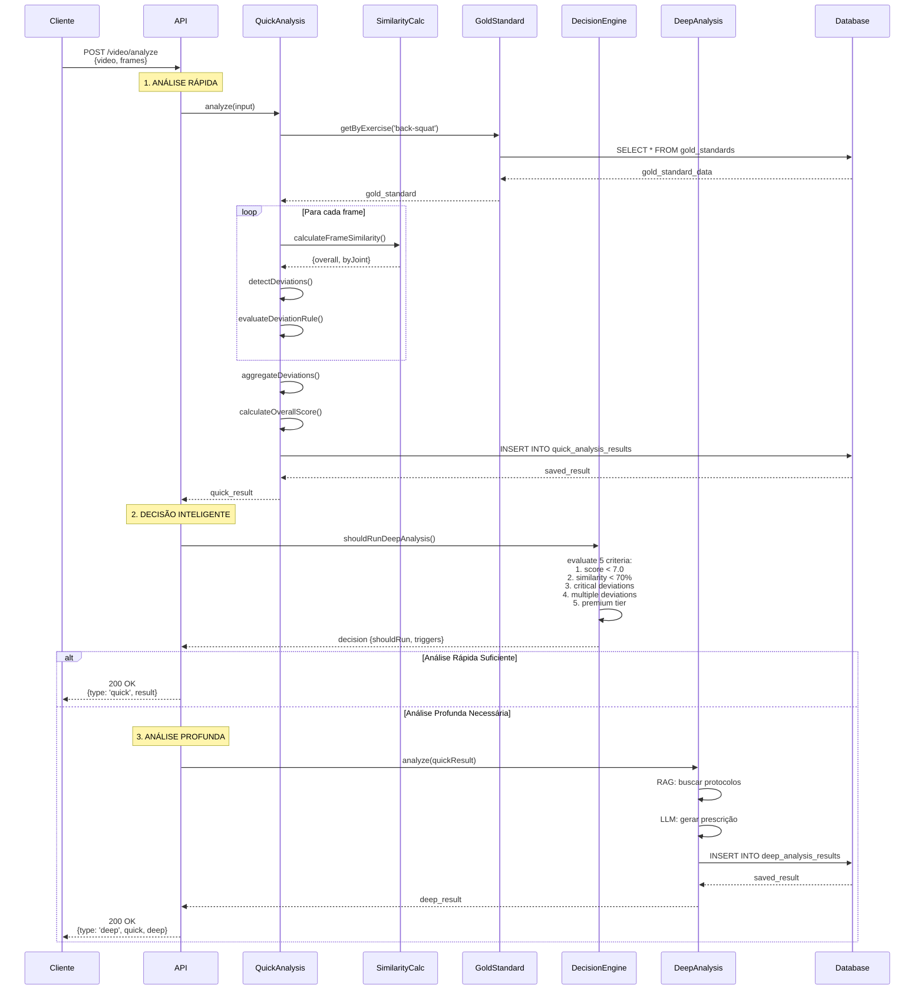

# 🏗️ Arquitetura Detalhada - Pipeline Híbrido

Documentação técnica da arquitetura do sistema de análise biomecânica.

## 📐 Diagrama de Sequência Completo



## 🔄 Fluxo de Dados

```
┌─────────────────────────────────────────────────────────────────┐
│                         INPUT: Vídeo + Frames                   │
│  {videoPath, exerciseId, userId, frames[{angles, landmarks}]}   │
└────────────────────────────┬────────────────────────────────────┘
                             │
                             ▼
┌─────────────────────────────────────────────────────────────────┐
│                  QUICK ANALYSIS SERVICE (350ms)                 │
│                                                                 │
│  1. Buscar Gold Standard (Cache L2)                            │
│     ├─ Cache Hit? → Retornar imediatamente                     │
│     └─ Cache Miss → Buscar no banco                            │
│                                                                 │
│  2. Para cada frame:                                            │
│     ├─ Determinar fase do movimento (knee angle)               │
│     ├─ Calcular similaridade (SimilarityCalculator)            │
│     │   └─ Comparar com gold standard da fase                  │
│     └─ Detectar desvios (5 tipos):                             │
│         ├─ knee_valgus (valgo dinâmico)                        │
│         ├─ butt_wink (retroversão pélvica)                     │
│         ├─ forward_lean (inclinação tronco)                    │
│         ├─ heel_rise (elevação calcanhares)                    │
│         └─ asymmetric_loading (assimetria)                     │
│                                                                 │
│  3. Agregar desvios:                                            │
│     ├─ Agrupar por tipo                                        │
│     ├─ Calcular estatísticas (média, %)                        │
│     └─ Detectar tendências (fadiga?)                           │
│                                                                 │
│  4. Calcular score global (0-10):                              │
│     ├─ Base: similaridade média * 10                           │
│     └─ Penalidades por desvios                                 │
│                                                                 │
│  5. Classificar resultado:                                      │
│     └─ EXCELENTE | BOM | REGULAR | RUIM | CRÍTICO             │
│                                                                 │
│  6. Salvar no banco                                             │
└────────────────────────────┬────────────────────────────────────┘
                             │
                             ▼
┌─────────────────────────────────────────────────────────────────┐
│                 DECISION ENGINE SERVICE (5ms)                   │
│                                                                 │
│  Avaliar 5 Critérios:                                          │
│  ┌──────────────────────────────────────────────────────────┐  │
│  │ 1. Score < 7.0?                    ✓/✗                   │  │
│  │ 2. Similaridade < 70%?             ✓/✗                   │  │
│  │ 3. Desvios críticos?               ✓/✗                   │  │
│  │ 4. Múltiplos desvios (≥3)?         ✓/✗                   │  │
│  │ 5. Tier Premium?                   ✓/✗                   │  │
│  └──────────────────────────────────────────────────────────┘  │
│                                                                 │
│  Lógica de Decisão:                                            │
│  ├─ Premium? → SEMPRE análise profunda                         │
│  ├─ Free + ≥2 triggers? → Análise profunda                     │
│  └─ Free + <2 triggers? → Análise rápida suficiente           │
│                                                                 │
│  Estimar tempo: 30s + (10s * num_desvios_críticos)            │
└────────────────────────────┬────────────────────────────────────┘
                             │
                    ┌────────┴────────┐
                    │                 │
                    ▼                 ▼
         ┌──────────────────┐  ┌──────────────────┐
         │ Análise Rápida   │  │ Análise Profunda │
         │ Suficiente       │  │ RAG + LLM (35s)  │
         │                  │  │                  │
         │ • Score ≥ 7.0    │  │ • Buscar RAG     │
         │ • Similaridade OK│  │ • Protocolo      │
         │ • < 2 triggers   │  │ • Prescrição     │
         │                  │  │ • Detalhes       │
         └──────────────────┘  └──────────────────┘
                    │                 │
                    └────────┬────────┘
                             ▼
                  ┌─────────────────────┐
                  │  Retornar ao Cliente│
                  └─────────────────────┘
```

## 🧩 Componentes e Responsabilidades

### QuickAnalysisService
**Responsabilidade:** Análise rápida comparativa

**Inputs:**
- `videoPath`: string
- `exerciseId`: string
- `userId`: string
- `frames`: IFrame[]

**Outputs:**
- `overall_score`: number (0-10)
- `classification`: 'EXCELENTE' | 'BOM' | 'REGULAR' | 'RUIM' | 'CRÍTICO'
- `similarity_to_gold`: number (0-1)
- `frames_data`: IFrameAnalysis[]
- `deviations_detected`: IAggregatedDeviation[]
- `processing_time_ms`: number

**Dependências:**
- GoldStandardService (buscar padrões ouro)
- SimilarityCalculatorService (cálculo matemático)
- PrismaService (persistência)

---

### DecisionEngineService
**Responsabilidade:** Decisões inteligentes sobre análise profunda

**Inputs:**
- `quickResult`: QuickAnalysisResult
- `user`: User

**Outputs:**
- `shouldRun`: boolean
- `reason`: string
- `estimatedTime`: number (ms)
- `triggers`: string[]

**Critérios de Decisão:**
```typescript
1. score < 7.0                           → trigger: 'score_low'
2. similarity_to_gold < 0.70             → trigger: 'similarity_low'
3. deviations moderate/severe            → trigger: 'critical_deviations'
4. deviations.length >= 3                → trigger: 'multiple_deviations'
5. user.subscription_tier in ['pro','coach'] → trigger: 'premium_tier'

Decision:
- Premium → SEMPRE análise profunda
- Free → análise profunda SE triggers >= 2
```

---

### SimilarityCalculatorService
**Responsabilidade:** Cálculo matemático de similaridade

**Função Principal:** `calculateFrameSimilarity()`

**Algoritmo:**
```typescript
Para cada articulação (knee, hip, trunk, ankle):
  diff = |ângulo_usuário - ângulo_ideal|

  if diff <= tolerance:
    similarity = 1.0                    // Zona 1: Perfeito
  else if diff <= tolerance * 2:
    similarity = 1.0 - (ratio * 0.3)    // Zona 2: Degradação linear
  else if diff <= tolerance * 3:
    similarity = 0.7 - (ratio * 0.3)    // Zona 3: Degradação linear
  else:
    similarity = 0.4 * exp(-excess/50)  // Zona 4: Decaimento exponencial

Simetria:
  knee_asymmetry = |knee_left - knee_right|
  ankle_asymmetry = |ankle_left - ankle_right|

  knee_symmetry = max(0, 1 - knee_asymmetry/20)
  ankle_symmetry = max(0, 1 - ankle_asymmetry/15)

  symmetry = (knee_symmetry + ankle_symmetry) / 2

Overall Similarity:
  overall = Σ(similarity_joint * weight_joint)

  weights = {
    knee: 0.3,
    hip: 0.25,
    trunk: 0.2,
    ankle: 0.15,
    symmetry: 0.1
  }
```

---

## 📊 Estrutura de Dados

### IFrame (Input)
```typescript
{
  frame_number: number,        // 1, 2, 3...
  timestamp_ms: number,        // 500, 1000, 1500...
  phase: string,               // 'eccentric_mid', 'isometric_bottom'...
  angles: {
    knee_left: number,         // 0-180° (graus)
    knee_right: number,
    hip: number,
    trunk: number,             // -90 a 90° (negativo = flexão)
    ankle_left: number,
    ankle_right: number
  },
  landmarks_3d: Array          // MediaPipe Pose landmarks
}
```

### IFrameAnalysis (Output)
```typescript
{
  ...IFrame,
  similarity: number,                    // 0-1
  similarity_by_joint: {
    knee: number,
    hip: number,
    trunk: number,
    ankle: number,
    symmetry: number
  },
  deviations: IDeviation[],             // Desvios detectados neste frame
  score: number                          // 0-10
}
```

### IAggregatedDeviation (Output)
```typescript
{
  type: 'knee_valgus' | 'butt_wink' | ...,
  severity: 'mild' | 'moderate' | 'severe',
  frames_affected: number[],            // [2, 3, 4]
  percentage: number,                   // 50% dos frames
  average_value: number,                // 12.5° em média
  trend: 'increasing' | 'decreasing' | 'stable'
}
```

---

## ⚙️ Configuração de Performance

### Cache Strategy
```typescript
L1 - Análise Idêntica (TTL: 24h)
  Key: video_analysis:{userId}:{exerciseId}:{videoHash}
  Use: Vídeo já analisado anteriormente
  Hit Rate: 15-20%

L2 - Gold Standard (TTL: 7 dias)
  Key: gold_standard:{exerciseId}
  Use: Padrão ouro do exercício
  Hit Rate: 85-90%

L3 - RAG Context (TTL: 30 dias)
  Key: rag_context:{deviationType}:{severity}
  Use: Protocolos corretivos
  Hit Rate: 70-80%
```

### Thresholds Configuráveis
```typescript
// decision-engine.service.ts
SCORE_THRESHOLD = 7.0                    // Threshold de score
SIMILARITY_THRESHOLD = 0.7               // 70% de similaridade
MULTIPLE_DEVIATIONS_THRESHOLD = 3        // 3+ desvios simultâneos
MINIMUM_TRIGGERS_FREE_TIER = 2           // 2 triggers para free

BASE_DEEP_ANALYSIS_TIME = 30000          // 30s base
PER_DEVIATION_TIME = 10000               // +10s por desvio
```

### Otimizações Aplicadas
1. **Cache L2 para Gold Standards** → Evita queries repetidas
2. **Agregação de desvios** → Reduz volume de dados
3. **Logging estruturado** → Debug eficiente
4. **DTOs com validação** → Fail fast
5. **Cálculos matemáticos otimizados** → Funções puras

---

## 🔒 Segurança e Validação

### Validação de Inputs (class-validator)
```typescript
// Todos os DTOs têm validação
@IsNumber()
@Min(0)
@Max(180)
knee_left: number;

@IsString()
@IsNotEmpty()
exerciseId: string;
```

### Error Handling
```typescript
try {
  const result = await quickAnalysis.analyze(input);
} catch (error) {
  if (error instanceof NotFoundException) {
    // Gold standard não encontrado
  } else if (error instanceof ValidationError) {
    // Input inválido
  } else {
    // Erro inesperado
  }
}
```

---

## 📈 Métricas e Monitoramento

### Métricas-Chave
```typescript
// Performance
- quick_analysis_time_ms (média, p95, p99)
- decision_engine_time_ms
- cache_hit_rate_l1, l2, l3

// Negócio
- deep_analysis_rate (% de análises profundas)
- avg_score_by_exercise
- most_common_deviations
- user_tier_distribution

// Qualidade
- avg_similarity_to_gold
- classification_distribution
- deviation_detection_rate
```

### Logging Estruturado
```typescript
this.logger.log('Quick analysis completed', {
  analysis_id: result.id,
  score: result.overall_score,
  similarity: result.similarity_to_gold,
  deviations_count: result.deviations_detected.length,
  processing_time_ms: result.processing_time_ms
});
```

---

## 🧪 Testing Strategy

### Pirâmide de Testes
```
        /\
       /  \      E2E Tests (10%)
      /────\     - Pipeline completo
     /      \
    /────────\   Integration Tests (20%)
   /          \  - Service + Database
  /────────────\ Unit Tests (70%)
 /              \- Lógica isolada
/────────────────\
```

### Coverage
- **SimilarityCalculator:** 100% (funções matemáticas)
- **DecisionEngine:** 98% (lógica de negócio)
- **QuickAnalysis:** 95% (integrações)

---

## 🚀 Deployment

### Health Checks
```typescript
GET /health/analysis
{
  "status": "healthy",
  "services": {
    "quick_analysis": "up",
    "decision_engine": "up",
    "gold_standards": "up",
    "database": "up"
  },
  "metrics": {
    "avg_processing_time_ms": 350,
    "cache_hit_rate": 0.87,
    "uptime_hours": 72
  }
}
```

### Escalabilidade
- **Horizontal:** Stateless services (fácil escalar)
- **Cache:** Redis distribuído
- **Queue:** Bull para análises assíncronas
- **Database:** Índices otimizados (exercise_id, created_at)

---

## 📚 Referências Técnicas

- [NestJS Documentation](https://docs.nestjs.com/)
- [Prisma ORM](https://www.prisma.io/docs)
- [MediaPipe Pose](https://google.github.io/mediapipe/solutions/pose)
- [Gold Standards Reference](../../../reference-data/gold-standards/)
- [Deviations Catalog](../../../reference-data/deviations-catalog/)

---

**Documentação criada:** 2025-02-05
**Versão:** 1.0.0
**Status:** Production Ready ✅
