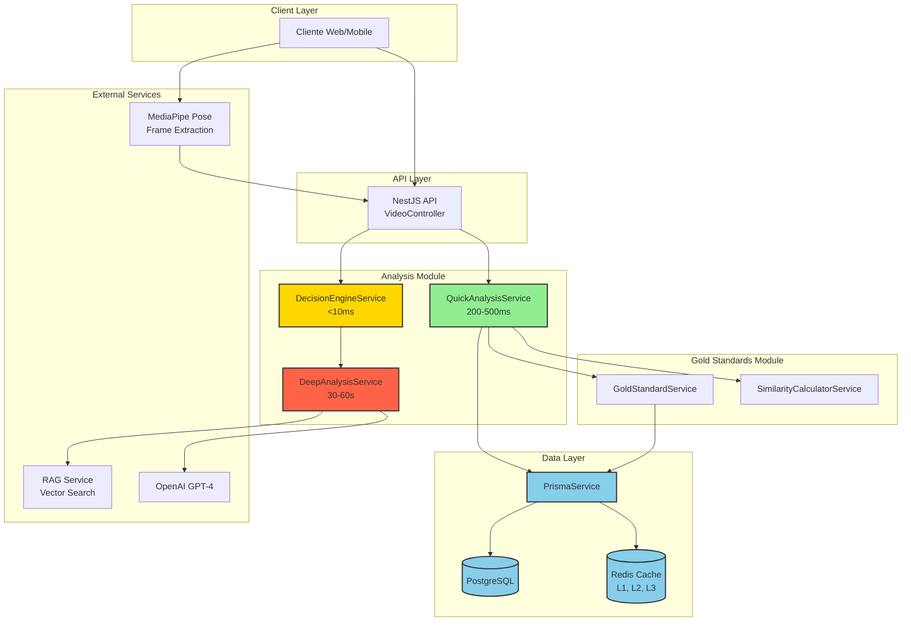
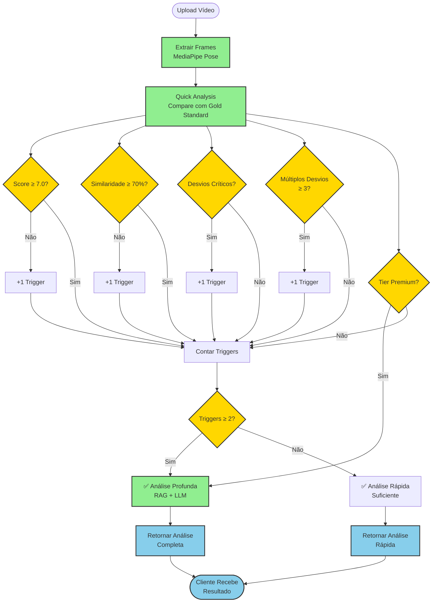
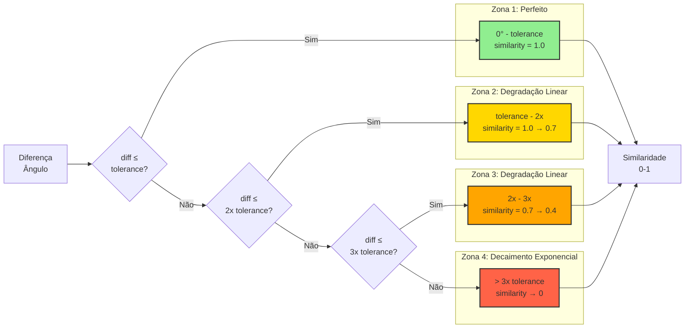
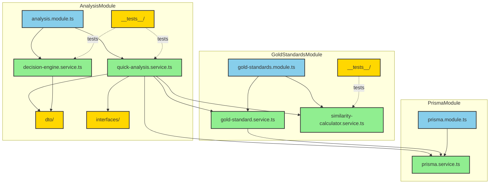
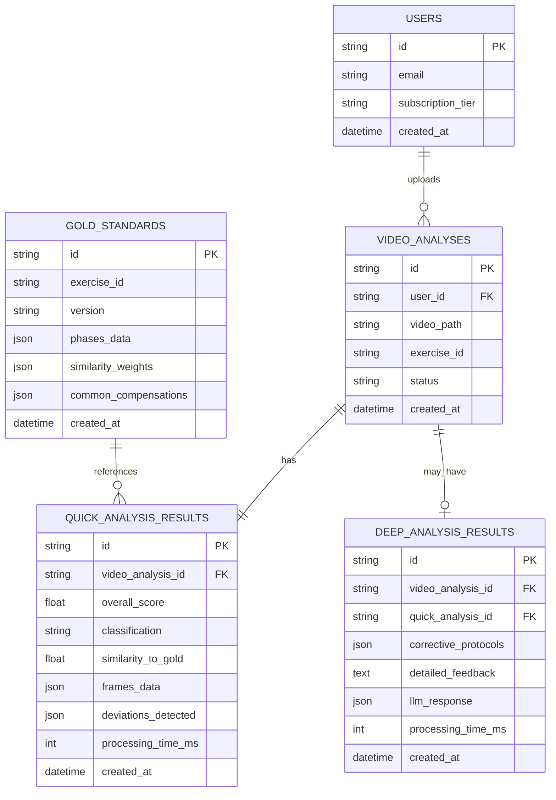
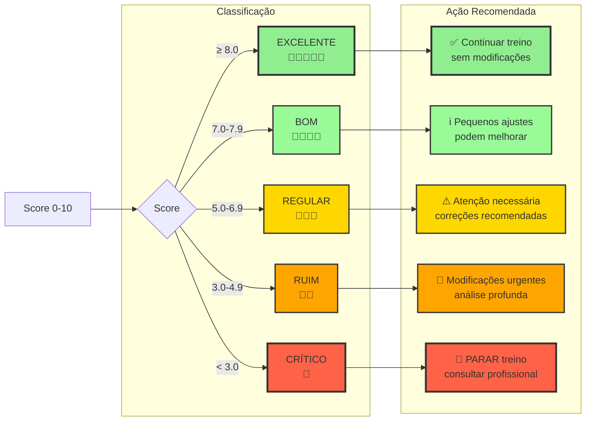
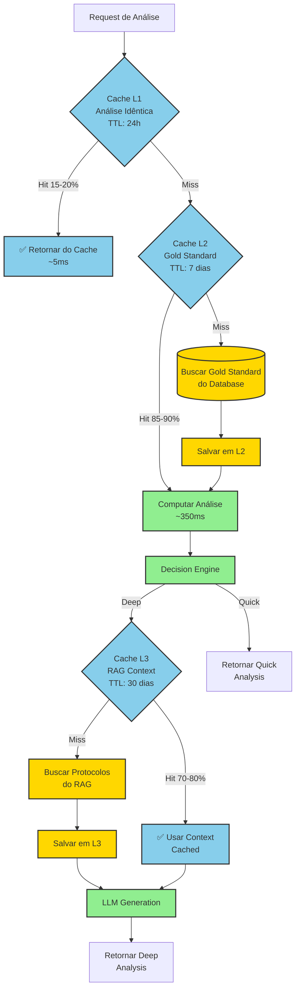
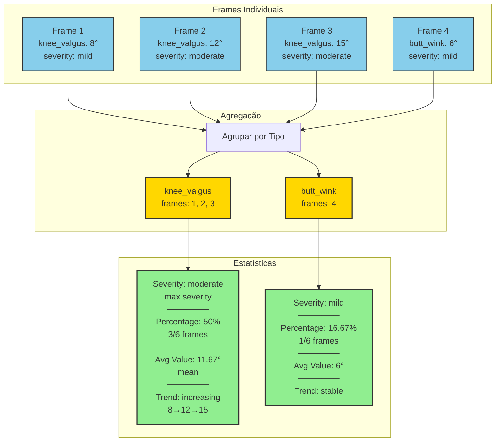

# 📊 Diagramas Visuais - Pipeline Híbrido

Representações visuais da arquitetura e fluxos do sistema.

## 🏛️ Arquitetura de Componentes



## 🔄 Fluxo de Decisão



## 🎯 Detecção de Desvios

```mermaid
flowchart LR
    subgraph "Input Frame"
        ANGLES[Ângulos Medidos<br/>knee: 90°/115°<br/>hip: 85°<br/>trunk: 45°<br/>ankle: 70°/70°]
    end

    subgraph "Gold Standard"
        GOLD_ANGLES[Ângulos Ideais<br/>knee: 90° ±5°<br/>hip: 85° ±5°<br/>trunk: 45° ±5°<br/>ankle: 70° ±5°]
    end

    subgraph "Deviation Detection"
        KNEE_CHECK{Knee:<br/>|90-115| = 25°<br/>> 20°?}
        HIP_CHECK{Hip:<br/>|85-85| = 0°<br/>> 5°?}
        TRUNK_CHECK{Trunk:<br/>|45-45| = 0°<br/>> 5°?}
        ANKLE_CHECK{Ankle:<br/>|70-70| = 0°<br/>> 5°?}
        ASYM_CHECK{Asymmetry:<br/>|90-115| = 25°<br/>> 20°?}
    end

    subgraph "Detected Deviations"
        DEV1[✅ knee_valgus<br/>severity: severe<br/>value: 25°]
        DEV2[✅ asymmetric_loading<br/>severity: severe<br/>value: 25°]
    end

    ANGLES --> KNEE_CHECK
    ANGLES --> HIP_CHECK
    ANGLES --> TRUNK_CHECK
    ANGLES --> ANKLE_CHECK
    ANGLES --> ASYM_CHECK

    GOLD_ANGLES --> KNEE_CHECK
    GOLD_ANGLES --> HIP_CHECK
    GOLD_ANGLES --> TRUNK_CHECK
    GOLD_ANGLES --> ANKLE_CHECK

    KNEE_CHECK -->|Sim| DEV1
    ASYM_CHECK -->|Sim| DEV2

    HIP_CHECK -->|Não| NONE1[❌ Sem desvio]
    TRUNK_CHECK -->|Não| NONE2[❌ Sem desvio]
    ANKLE_CHECK -->|Não| NONE3[❌ Sem desvio]

    classDef detected fill:#FF6347,stroke:#333,stroke-width:2px
    classDef ok fill:#90EE90,stroke:#333,stroke-width:2px

    class DEV1,DEV2 detected
    class NONE1,NONE2,NONE3 ok
```

## 📈 Função de Similaridade



## 🗂️ Estrutura de Módulos



## 💾 Modelo de Dados



## ⚡ Performance Timeline

```mermaid
gantt
    title Pipeline Híbrido - Timeline de Processamento
    dateFormat X
    axisFormat %L ms

    section Client
    Upload Video           :a1, 0, 100ms

    section Backend
    Extract Frames (MP)    :a2, 100, 300ms
    Quick Analysis         :a3, 400, 350ms
    Decision Engine        :a4, 750, 5ms

    section Quick Path
    Return Quick Result    :crit, a5, 755, 50ms

    section Deep Path
    RAG Search            :a6, 755, 15000ms
    LLM Generation        :a7, 15755, 20000ms
    Save Deep Result      :a8, 35755, 100ms
    Return Deep Result    :crit, a9, 35855, 50ms
```



## 🎨 Classificação de Scores



## 🔁 Cache Strategy



## 📊 Agregação de Desvios



---

## 🎓 Como Ler os Diagramas

### Cores
- 🟢 **Verde:** Processos/serviços principais
- 🟡 **Amarelo:** Decisões/lógica de negócio
- 🔵 **Azul:** Dados/cache/storage
- 🔴 **Vermelho:** Análise profunda/operações custosas

### Símbolos
- `()` : Início/Fim
- `[]` : Processo/Ação
- `{}` : Decisão
- `()` : Banco de dados
- `--` : Cache/opcional

### Fluxo
- `→` : Fluxo normal
- `-.->` : Dependência de teste
- `==>` : Fluxo crítico

---

**Diagramas criados com:** Mermaid
**Última atualização:** 2025-02-05
